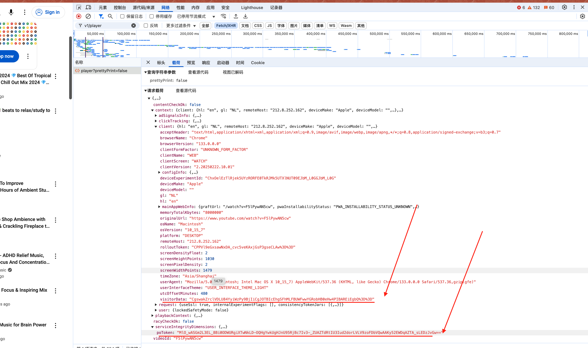

youtube 视频批量下载

使用方法:

代码 clone 下来后，确保安装了 node > 18 版本

`npm install`

0. 先挂上 VPN，确保能正常访问 YouTube.

1. 在未登陆 YouTube 的情况下，先从 v1/player 接口返回拿到 potoken 值

    具体方法[Add PoToken](https://pytubefix.readthedocs.io/en/latest/user/po_token.html)
    >>原始证明（PO）令牌是YouTube需要通过某些客户的视频播放请求发送的参数。如果没有它，受影响客户的格式URL请求可能会返回HTTP错误403，带有机器人检测的错误或导致您的帐户或IP地址被阻止。

     

2. 从 YouTube 网站复制视频 url ，粘贴到 index.mjs 的 urls 数组中:

    ```js
    // 待下载的 YouTube 视频链接
    const urls = [
      "https://www.youtube.com/watch?v=mphHFk5IXsQ",
      "https://www.youtube.com/watch?v=7m8nON7zf0U",
      "https://www.youtube.com/watch?v=V8myIkor52g",
    ];
    ```

3. 执行 `npm run install-video`

4. 下载完成后在文件夹 `videos/` 查看下载好的视频和对应的附加信息
